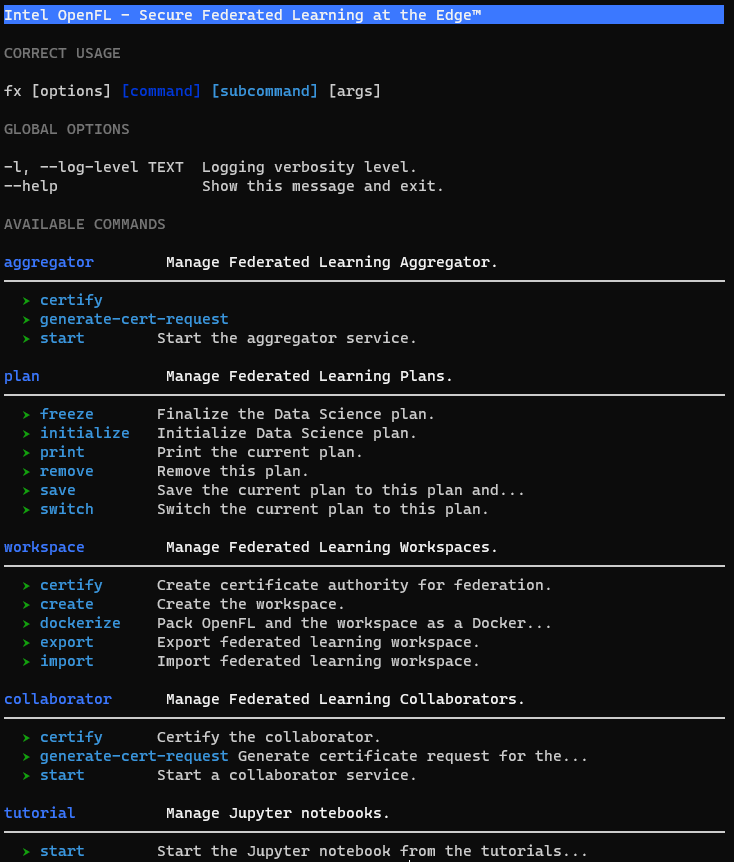

# Welcome to Intel&reg; OpenFL

[Federated learning](https://en.wikipedia.org/wiki/Federated_learning) is a distributed machine learning approach that
enables organizations to collaborate on machine learning projects
without sharing sensitive data, such as, patient records, financial data,
or classified secrets 
([Sheller MJ,  et al., 2020](https://www.nature.com/articles/s41598-020-69250-1);
[Sheller MJ, et al., 2019](https://www.ncbi.nlm.nih.gov/pmc/articles/PMC6589345);
[Yang Y, et al., 2019](https://arxiv.org/abs/1902.04885);
[McMahan HB, et al., 2016](https://arxiv.org/abs/1602.05629)).

The basic premise behind federated learning
is that the model moves to meet the data rather than the data moving
to meet the model. Therefore, the minimum data movement needed
across the federation is solely the model parameters and their updates.

OpenFL is a Python 3 project developed by Intel Labs and 
Intel Internet of Things Group. 

## Requirements

- OS: Tested on Ubuntu Linux 16.04 and 18.04.
- Python 3.6+ with a Python virtual environment (e.g. [conda](https://docs.conda.io/en/latest/))
- TensorFlow 2+ or PyTorch 1.6+ (depending on your training requirements). OpenFL is designed to easily support other frameworks as well.

## License
This project is licensed under [Apache License Version 2.0](LICENSE).
By contributing to the project, you agree to the license and copyright terms therein
and release your contribution under these terms.

## Resources:
* Docs: 
* Wiki: 
* Issue tracking: 

## Support
Please report questions, issues and suggestions using:

* [GitHub* Issues]()

### Relation to OpenFederatedLearning and the Federated Tumor Segmentation (FeTS) Initiative

This project builds on the [Open Federated Learning](https://github.com/IntelLabs/OpenFederatedLearning) framework that was 
developed as part of a collaboration between Intel
and the University of Pennsylvania (UPenn) for federated learning. 
It describes Intel’s commitment in 
supporting the grant awarded to the [Center for Biomedical Image Computing and Analytics (CBICA)](https://www.cbica.upenn.edu/) 
at UPenn (PI: S. Bakas) from the [Informatics Technology for Cancer Research (ITCR)](https://itcr.cancer.gov/) program of 
the National Cancer Institute (NCI) of the National Institutes of Health (NIH), 
for the development of the [Federated Tumor Segmentation (FeTS, www.fets.ai)](https://www.fets.ai/) 
platform (grant award number: U01-CA242871). 

FeTS is an exciting, real-world 
medical FL platform, and we are honored to be collaborating with UPenn in 
leading a federation of international collaborators. The original OpenFederatedLearning
project and OpenFL are designed to serve as the backend for the FeTS platform, 
and OpenFL developers and researchers continue to work very closely with UPenn on 
the FeTS project. The 
[FeTS-AI/Front-End](https://github.com/FETS-AI/Front-End) shows how UPenn 
and Intel have integrated UPenn’s medical AI expertise with Intel’s framework 
to create a federated learning solution for medical imaging. 

Although initially developed for use in medical imaging, this project is
designed to be agnostic to the use-case, the industry, and the 
machine learning framework.

