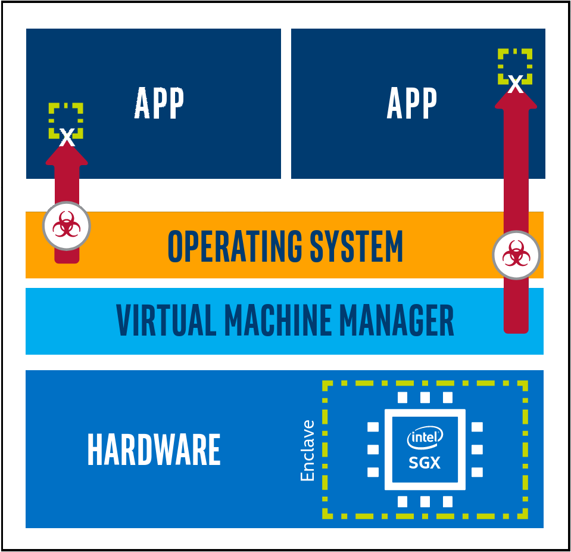
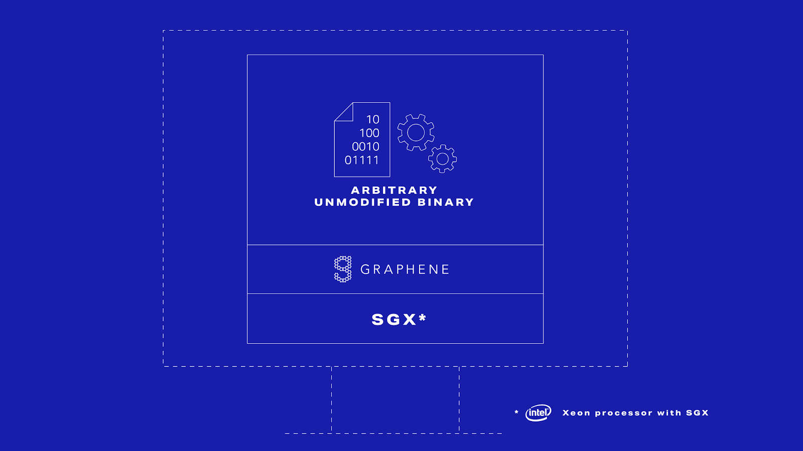

.. # Copyright (C) 2020-2023 Intel Corporation
.. # SPDX-License-Identifier: Apache-2.0

.. this page is not be included yet, so it's marked as an orphan.
.. Remove the below line when you're ready to publish this page.

:orphan:

*****************************************
How Can Intel Protect Federated Learning?
*****************************************

Intel\ :sup:`®` \ Software Guard Extensions (`SGX <https://software.intel.com/content/www/us/en/develop/topics/software-guard-extensions.html>`_)
are a set of CPU instructions that
can be used by developers to set aside private regions of code and data
(`Bahmani, et al., 2017 <https://hal.archives-ouvertes.fr/hal-01898742/file/2016-1057.pdf>`_).
These private regions, called `enclaves <https://en.wikipedia.org/wiki/Software_Guard_Extensions>`_,
are isolated sections of memory and compute that cannot be accessed
without a `cryptographic key <https://en.wikipedia.org/wiki/Cryptographic_key_types>`_. Even users with root access or physical
access to the CPU cannot access the enclave without the authorized key.

.. centered:: Intel\ :sup:`®` \ Software Guard Extensions

This allows for developers to deploy their code and data on untrusted
machines in a secure manner. In 2015, Intel\ :sup:`®` \ SGX was launched as the
`first commercial implementation <https://software.intel.com/content/www/us/en/develop/topics/software-guard-extensions/details.html>`_
of what is more formally called a
trusted execution environment (`TEE <https://en.wikipedia.org/wiki/Trusted_execution_environment>`_).

One path to enable Intel\ :sup:`®` \ SGX in an application is to refactor the
application code to use the `Intel SDK for SGX <https://software.intel.com/content/www/us/en/develop/topics/software-guard-extensions/sdk.html>`_. However, many developers
are reluctant to change their existing code.

`Graphene <https://github.com/oscarlab/graphene>`_ is an
open-source library OS (LibOS) that was created by Intel and its partners to
provide developers an easy way to leverage SGX without the need
to change their existing applications. Several commercial implementations
of SGX-enabled LibOSes have been created by our partners, including
`Fortanix <https://fortanix.com>`_ and `SContain <https://scontain.com>`_.

.. centered:: Graphene allows unmodified programs to be protected by SGX.

With Graphene, the developer simply defines a manifest file
that describes which code and data is allowed within the enclave.
This manifest file is used to automatically create the enclave on an
SGX-compatible CPU. For example, once Graphene is installed and the
manifest file is specified, the command

.. code-block:: console

  $ SGX=1 ./pal_loader httpd

will use the pal_loader command to create the enclave from the
manifest and run the web server (:code:`http`) within the enclave. No other
modifications are needed to protect the :code:`httpd` application with a SGX enclave.
