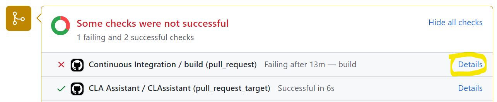

Contributing to OpenFL
=====================================================================

We welcome contributions from the community. We believe that anyone can bring something valuable to OpenFL and help us to improve the project. This document explains how to contribute to OpenFL. 

We accept various contributions from documentation improvement and bug fixing to major features proposals and [roadmap](https://github.com/intel/openfl/blob/develop/ROADMAP.md) suggestions.

Documentation improvement: review our [documentation](https://openfl.readthedocs.io/en/latest) and let us know if something is not clear or not relevant. 
Propose your own formulations or even write new section explaining something that you know how works, but do not see in the documentation. 
Propose it through GitHub [issues](https://github.com/intel/openfl/issues/new/choose) or [Discussions](https://github.com/intel/openfl/discussions).

To propose bugs, new features, or other code improvements:

1.	Check open and closed [issues](https://github.com/intel/openfl/issues) and make sure there is no similar proposal.
2.	Open a [new issue](https://github.com/intel/openfl/issues/new/choose), select a relevant category (Bug report / Feature request / Report a security vulnerability) and describe your idea using the template. 
3.	If you want to fix a bug or create this feature by yourself, prepare a contribution.
	-	Format your code following the [flake8 style](https://flake8.pycqa.org/en/latest/).
	-	Make sure that your code is original and corresponds to [OpenFL license](#license).
	-	Sing your work - [see below](#sign-your-work). 
	-	Create a [pull request](#formatting-of-pull-requests) and wait for feedback.
	-	Verify that all tests in our [CI/CD pipeline](#Continuous-Integration-and-Continuous-Development) passed.
4.	Hurrah! You are a new contributor to OpenFL! You will see your name in released notes of the subsequent releases!😊

Join our [Slack](https://join.slack.com/t/openfl/shared_invite/zt-ovzbohvn-T5fApk05~YS_iZhjJ5yaTw) and [Community meetings](https://github.com/intel/openfl#support) and participate in the discussions. 

Are you an expert in Federated Learning and want to contribute to our roadmap? You can nominate yourself as a member of our Technical Steering Committee and be part of the OpenFL decision making group. Please reach us through our [Slack](https://join.slack.com/t/openfl/shared_invite/zt-ovzbohvn-T5fApk05~YS_iZhjJ5yaTw).

### Code format and style

We use [flake8](https://flake8.pycqa.org/en/latest/) for PEP8 style guide enforcement. This is run as a part of our CI/CD pipeline and it’s required prior a merge. 

### Formatting of Pull Requests

OpenFL follows standard recommendations of PR formatting. Please find more details [here](https://github.blog/2015-01-21-how-to-write-the-perfect-pull-request/).

### Continuous Integration and Continuous Development

OpenFL uses GitHub actions to perform all functional and unit tests. Before your contribution can be merged make sure that all your tests are passing. 
For more information of what fails you can click on the “details” link near the pipeline that failed.


 
### Writing the tests

The OpenFL team recommend including tests for all new features contributions. Test can be found in the “Tests” directory. 
The [Tests/OpenFL folder](https://github.com/intel/openfl/tree/develop/tests/openfl) contains unit tests and the [Tests/GitHub folder](https://github.com/intel/openfl/tree/develop/tests/github) contains end-to-end and functional tests.

### License

OpenFL is licensed under the terms in [Apache 2.0 license](https://github.com/intel/openfl/blob/develop/LICENSE). By contributing to the project, you agree to the license and copyright terms therein and release your contribution under these terms.

### Sign your work

Please use the sign-off line at the end of the patch. Your signature certifies that you wrote the patch or otherwise have the right to pass it on as an open-source patch. The rules are pretty simple: if you can certify
the below (from [developercertificate.org](http://developercertificate.org/)):

```
Developer Certificate of Origin
Version 1.1

Copyright (C) 2004, 2006 The Linux Foundation and its contributors.
660 York Street, Suite 102,
San Francisco, CA 94110 USA

Everyone is permitted to copy and distribute verbatim copies of this
license document, but changing it is not allowed.

Developer's Certificate of Origin 1.1

By making a contribution to this project, I certify that:

(a) The contribution was created in whole or in part by me and I
    have the right to submit it under the open source license
    indicated in the file; or

(b) The contribution is based upon previous work that, to the best
    of my knowledge, is covered under an appropriate open source
    license and I have the right under that license to submit that
    work with modifications, whether created in whole or in part
    by me, under the same open source license (unless I am
    permitted to submit under a different license), as indicated
    in the file; or

(c) The contribution was provided directly to me by some other
    person who certified (a), (b) or (c) and I have not modified
    it.

(d) I understand and agree that this project and the contribution
    are public and that a record of the contribution (including all
    personal information I submit with it, including my sign-off) is
    maintained indefinitely and may be redistributed consistent with
    this project or the open source license(s) involved.
```

Then you just add a line to every git commit message:

    Signed-off-by: Joe Smith <joe.smith@email.com>

Use your real name (sorry, no pseudonyms or anonymous contributions.)

If you set your `user.name` and `user.email` git configs, you can sign your
commit automatically with `git commit -s`.
