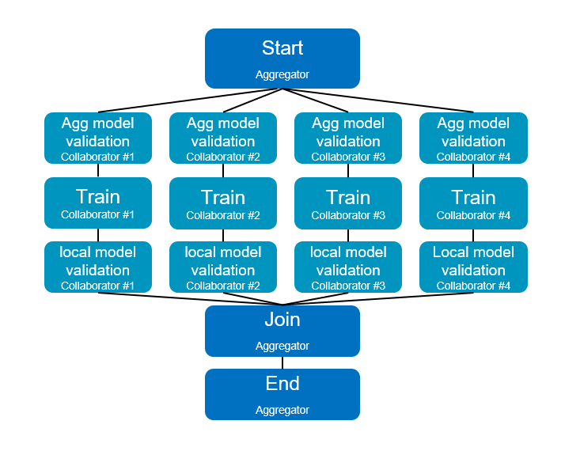

.. # Copyright (C) 2020-2023 Intel Corporation
.. # SPDX-License-Identifier: Apache-2.0

.. _workflowinterface_pytorch_mnist:

============================================
Workflow Interface: Federated PyTorch MNIST
============================================

This tutorial introduces the API to get up and running with your first horizontal federated learning workflow. This work has the following goals:

- Simplify the federated workflow representation

- Help users better understand the steps in federated learning (weight extraction, compression, etc.)

- Designed to maintain data privacy

- Aims for syntatic consistency with the Netflix MetaFlow project. Infrastructure reuse where possible.

See `full notebook <https://github.com/securefederatedai/openfl/blob/f1657abe88632d542504d6d71ca961de9333913f/openfl-tutorials/experimental/Workflow_Interface_101_MNIST.ipynb>`_.

**What is it?**
The workflow interface is a new way of composing federated learning experiments with |productName|. 
It was borne through conversations with researchers and existing users who had novel use cases that didn't quite fit the standard horizontal federated learning paradigm.

**Getting Started**
First we start by installing the necessary dependencies for the workflow interface:

.. code-block:: console

    $ pip install git+https://github.com/intel/openfl.git
    $ pip install -r requirements_workflow_interface.txt
    $ pip install torch
    $ pip install torchvision

We begin with the quintessential example of a small pytorch CNN model trained on the MNIST dataset. 
Let's start define our dataloaders, model, optimizer, and some helper functions like we would for any other deep learning experiment

.. code-block:: python

    import torch.nn as nn
    import torch.nn.functional as F
    import torch.optim as optim
    import torch
    import torchvision
    import numpy as np

    n_epochs = 3
    batch_size_train = 64
    batch_size_test = 1000
    learning_rate = 0.01
    momentum = 0.5
    log_interval = 10

    random_seed = 1
    torch.backends.cudnn.enabled = False
    torch.manual_seed(random_seed)

    mnist_train = torchvision.datasets.MNIST(
        "./files/",
        train=True,
        download=True,
        transform=torchvision.transforms.Compose(
            [
                torchvision.transforms.ToTensor(),
                torchvision.transforms.Normalize((0.1307,), (0.3081,)),
            ]
        ),
    )

    mnist_test = torchvision.datasets.MNIST(
        "./files/",
        train=False,
        download=True,
        transform=torchvision.transforms.Compose(
            [
                torchvision.transforms.ToTensor(),
                torchvision.transforms.Normalize((0.1307,), (0.3081,)),
            ]
        ),
    )

    class Net(nn.Module):
        def __init__(self):
            super(Net, self).__init__()
            self.conv1 = nn.Conv2d(1, 10, kernel_size=5)
            self.conv2 = nn.Conv2d(10, 20, kernel_size=5)
            self.conv2_drop = nn.Dropout2d()
            self.fc1 = nn.Linear(320, 50)
            self.fc2 = nn.Linear(50, 10)

        def forward(self, x):
            x = F.relu(F.max_pool2d(self.conv1(x), 2))
            x = F.relu(F.max_pool2d(self.conv2_drop(self.conv2(x)), 2))
            x = x.view(-1, 320)
            x = F.relu(self.fc1(x))
            x = F.dropout(x, training=self.training)
            x = self.fc2(x)
            return F.log_softmax(x)
        
    def inference(network,test_loader):
        network.eval()
        test_loss = 0
        correct = 0
        with torch.no_grad():
        for data, target in test_loader:
            output = network(data)
            test_loss += F.nll_loss(output, target, size_average=False).item()
            pred = output.data.max(1, keepdim=True)[1]
            correct += pred.eq(target.data.view_as(pred)).sum()
        test_loss /= len(test_loader.dataset)
        print('\nTest set: Avg. loss: {:.4f}, Accuracy: {}/{} ({:.0f}%)\n'.format(
        test_loss, correct, len(test_loader.dataset),
        100. * correct / len(test_loader.dataset)))
        accuracy = float(correct / len(test_loader.dataset))
        return accuracy

Next we import the FLSpec, LocalRuntime, and placement decorators.

- FLSpec – Defines the flow specification. User defined flows are subclasses of this.

- Runtime – Defines where the flow runs, infrastructure for task transitions (how information gets sent). The LocalRuntime runs the flow on a single node.

- aggregator/collaborator - placement decorators that define where the task will be assigned

.. code-block:: python

    from copy import deepcopy

    from openfl.experimental.interface import FLSpec, Aggregator, Collaborator
    from openfl.experimental.runtime import LocalRuntime
    from openfl.experimental.placement import aggregator, collaborator

    def FedAvg(models, weights=None):
        new_model = models[0]
        state_dicts = [model.state_dict() for model in models]
        state_dict = new_model.state_dict()
        for key in models[1].state_dict():
            state_dict[key] = torch.from_numpy(np.average([state[key].numpy() for state in state_dicts],
                                                        axis=0, 
                                                        weights=weights))
        new_model.load_state_dict(state_dict)
        return new_model

Now we come to the flow definition. 
The |productName| Workflow Interface adopts the conventions set by Metaflow, that every workflow begins with `start` 
and concludes with the `end` task. The aggregator begins with an optionally passed in model and optimizer. 
The aggregator begins the flow with the `start` task, 
where the list of collaborators is extracted from the runtime (`self.collaborators = self.runtime.collaborators`) 
and is then used as the list of participants to run the task listed in `self.next`, `aggregated_model_validation`. 
The model, optimizer, and anything that is not explicitly excluded from the next function will be passed from the `start` 
function on the aggregator to the `aggregated_model_validation` task on the collaborator. Where the tasks run is determined by the placement decorator that precedes each task definition (`@aggregator` or `@collaborator`). Once each of the collaborators (defined in the runtime) complete the `aggregated_model_validation` task, they pass their current state onto the `train` task, from `train` to `local_model_validation`, and then finally to `join` at the aggregator. It is in `join` that an average is taken of the model weights, and the next round can begin.\n",

.. code-block:: python

    class FederatedFlow(FLSpec):

        def __init__(self, model=None, optimizer=None, rounds=3, **kwargs):
            super().__init__(**kwargs)
            if model is not None:
                self.model = model
                self.optimizer = optimizer
            else:
                self.model = Net()
                self.optimizer = optim.SGD(self.model.parameters(), lr=learning_rate,
                                        momentum=momentum)
            self.rounds = rounds

        @aggregator
        def start(self):
            print(f'Performing initialization for model')
            self.collaborators = self.runtime.collaborators
            self.private = 10
            self.current_round = 0
            self.next(self.aggregated_model_validation, foreach='collaborators', exclude=['private'])

        @collaborator
        def aggregated_model_validation(self):
            print(f'Performing aggregated model validation for collaborator {self.input}')
            self.agg_validation_score = inference(self.model, self.test_loader)
            print(f'{self.input} value of {self.agg_validation_score}')
            self.next(self.train)

        @collaborator
        def train(self):
            self.model.train()
            self.optimizer = optim.SGD(self.model.parameters(), lr=learning_rate,
                                    momentum=momentum)
            train_losses = []
            for batch_idx, (data, target) in enumerate(self.train_loader):
                self.optimizer.zero_grad()
                output = self.model(data)
                loss = F.nll_loss(output, target)
                loss.backward()
                self.optimizer.step()
                if batch_idx % log_interval == 0:
                    print('Train Epoch: 1 [{}/{} ({:.0f}%)]\tLoss: {:.6f}'.format(
                        batch_idx * len(data), len(self.train_loader.dataset),
                        100. * batch_idx / len(self.train_loader), loss.item()))
                    self.loss = loss.item()
                    torch.save(self.model.state_dict(), 'model.pth')
                    torch.save(self.optimizer.state_dict(), 'optimizer.pth')
            self.training_completed = True
            self.next(self.local_model_validation)

        @collaborator
        def local_model_validation(self):
            self.local_validation_score = inference(self.model, self.test_loader)
            print(
                f'Doing local model validation for collaborator {self.input}: {self.local_validation_score}')
            self.next(self.join, exclude=['training_completed'])

        @aggregator
        def join(self, inputs):
            self.average_loss = sum(input.loss for input in inputs) / len(inputs)
            self.aggregated_model_accuracy = sum(
                input.agg_validation_score for input in inputs) / len(inputs)
            self.local_model_accuracy = sum(
                input.local_validation_score for input in inputs) / len(inputs)
            print(f'Average aggregated model validation values = {self.aggregated_model_accuracy}')
            print(f'Average training loss = {self.average_loss}')
            print(f'Average local model validation values = {self.local_model_accuracy}')
            self.model = FedAvg([input.model for input in inputs])
            self.optimizer = [input.optimizer for input in inputs][0]
            self.current_round += 1
            if self.current_round < self.rounds:
                self.next(self.aggregated_model_validation,
                        foreach='collaborators', exclude=['private'])
            else:
                self.next(self.end)

        @aggregator
        def end(self):
            print(f'This is the end of the flow') 

You'll notice in the `FederatedFlow` definition above that there were certain attributes that the flow was not initialized with, namely the `train_loader` and `test_loader` for each of the collaborators. These are **private_attributes** that are exposed only throught he runtime. Each participant has it's own set of private attributes: a dictionary where the key is the attribute name, and the value is the object that will be made accessible through that participant's task.

Below, we segment shards of the MNIST dataset for **four collaborators**: Portland, Seattle, Chandler, and Portland. Each has their own slice of the dataset that's accessible via the `train_loader` or `test_loader` attribute. Note that the private attributes are flexible, and you can choose to pass in a completely different type of object to any of the collaborators or aggregator (with an arbitrary name). These private attributes will always be filtered out of the current state when transfering from collaborator to aggregator, or vice versa.

.. code-block:: python

    # Aggregator
    aggregator_ = Aggregator()

    collaborator_names = ["Portland", "Seattle", "Chandler", "Bangalore"]

    def callable_to_initialize_collaborator_private_attributes(index, n_collaborators, batch_size, train_dataset, test_dataset):
        train = deepcopy(train_dataset)
        test = deepcopy(test_dataset)
        train.data = train_dataset.data[index::n_collaborators]
        train.targets = train_dataset.targets[index::n_collaborators]
        test.data = test_dataset.data[index::n_collaborators]
        test.targets = test_dataset.targets[index::n_collaborators]

        return {
            "train_loader": torch.utils.data.DataLoader(train, batch_size=batch_size, shuffle=True),
            "test_loader": torch.utils.data.DataLoader(test, batch_size=batch_size, shuffle=True),
        }

    # Setup collaborators private attributes via callable function
    collaborators = []
    for idx, collaborator_name in enumerate(collaborator_names):
        collaborators.append(
            Collaborator(
                name=collaborator_name,
                private_attributes_callable=callable_to_initialize_collaborator_private_attributes,
                index=idx, 
                n_collaborators=len(collaborator_names),
                train_dataset=mnist_train, 
                test_dataset=mnist_test, 
                batch_size=64
            )
        )

    local_runtime = LocalRuntime(aggregator=aggregator_, collaborators=collaborators,
                                backend="ray")
    print(f'Local runtime collaborators = {local_runtime.collaborators}')

Now that we have our flow and runtime defined, let's run the experiment!

.. code-block:: python

    model = None
    best_model = None
    optimizer = None
    flflow = FederatedFlow(model, optimizer, checkpoint=True)
    flflow.runtime = local_runtime
    flflow.run()

Now that the flow has completed, let's get the final model and accuracy:

.. code-block:: python

    print(f'Sample of the final model weights: {flflow.model.state_dict()["conv1.weight"][0]}')

    print(f'\nFinal aggregated model accuracy for {flflow.rounds} rounds of training: {flflow.aggregated_model_accuracy}')

We can get the final model, and all other aggregator attributes after the flow completes. But what if there's an intermediate model task and its specific output that we want to look at in detail? This is where **checkpointing** and reuse of Metaflow tooling come in handy.

Let's make a tweak to the flow object, and run the experiment one more time (we can even use our previous model / optimizer as a base for the experiment)

.. code-block:: python

    flflow2 = FederatedFlow(model=flflow.model, optimizer=flflow.optimizer, checkpoint=True)
    flflow2.runtime = local_runtime
    flflow2.run()

Now that the flow is complete, let's dig into some of the information captured along the way

.. code-block:: python

    run_id = flflow2._run_id

.. code-block:: python

    import metaflow
    from metaflow import Metaflow, Flow, Task, Step

.. code-block:: python

    m = Metaflow()
    list(m)

For existing users of Metaflow, you'll notice this is the same way you would examine a flow after completion. Let's look at the latest run that generated some results:

.. code-block:: python

    f = Flow('FederatedFlow').latest_run
    f

And its list of steps

.. code-block:: python

    list(f)

This matches the list of steps executed in the flow, so far so good...

.. code-block:: python

    s = Step(f'FederatedFlow/{run_id}/train')
    s

.. code-block:: python

    list(s)

Now we see 12 steps: 4 collaborators each performed 3 rounds of model training

.. code-block:: python

    t = Task(f'FederatedFlow/{run_id}/train/9')
    t

.. code-block:: python

    t.data

.. code-block:: python

    t.data.input

Now let's look at its log output (stdout) and any error logs (stderr)

.. code-block:: python

    print(t.stdout)
    print(t.stderr)

**Congratulations!**
Now that you've completed your first workflow interface quickstart notebook, 

see some of the more advanced things you can do in our other `tutorials <https://github.com/securefederatedai/openfl/tree/f1657abe88632d542504d6d71ca961de9333913f/openfl-tutorials/experimental>`_, including:

- Using the LocalRuntime Ray Backend for dedicated GPU access
- Vertical Federated Learning
- Model Watermarking
- Differential Privacy
- And More!
