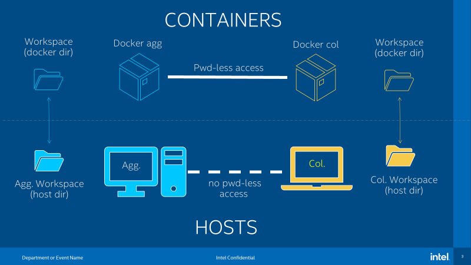

.. # Copyright (C) 2020-2021 Intel Corporation
.. # SPDX-License-Identifier: Apache-2.0

.. _install_docker:

*********************************************
Build the Docker\ :sup:`*`\  Image (Optional)
*********************************************

.. note::

   The Docker\ :sup:`*`\  version of |productName| is to provide an isolated environment complete with the prerequisites to run a federation. When the execution is over, the container can be destroyed and the results of the computation will be available on a directory on the local host.

1. Install Docker on all nodes in the federation.

2. Check that Docker is running properly with the *Hello World* command:

    .. code-block:: console

      $ docker run hello-world
      Hello from Docker!
      This message shows that your installation appears to be working correctly.
      ...
      ...
      ...
      
3. Build an image from the latest official |productName| release:

	.. parsed-literal::

	   $ docker pull intel/\ |productWheel|\
   
	If you prefer to build an image from a specific commit or branch, perform the following commands:

	.. parsed-literal::

	   $ git clone https://github.com/intel/openfl.git
	   $ cd \ |productWheel|
	   $ ./scripts/build_base_docker_image.sh

.. _install_docker_consideration:

Things to Consider
~~~~~~~~~~~~~~~~~~

Docker containers have the components to initiate and run a federation. However, there are tasks that require your attention.

  *  Orchestration and pipeline automation is currently not supported and would need to be handled manually.

  * `PKI exchange <https://en.wikipedia.org/wiki/Public_key_infrastructure>`_ required to validate and welcome new collaborators to the federation will need to be handled outside the containers through a bash script (not provided). The PKI exchange can also be performed manually in the following manner:

     * Copy the files (:code:`scp` or some other secure file transfer) from one host to another
     * Create a shared file system across the federation hosts. *This option might not be ideal for hosts not connected to the same internal network*

.. centered:: Docker Design

