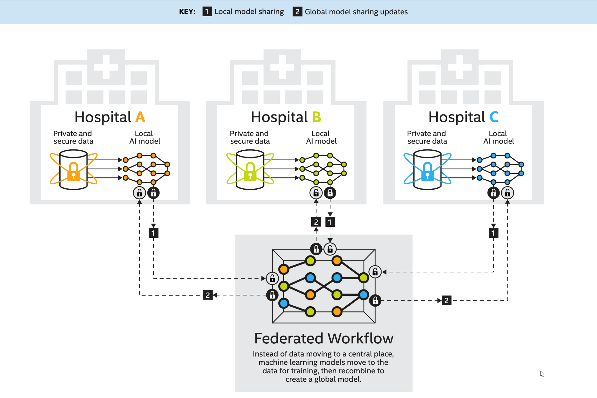

.. # Copyright (C) 2020-2021 Intel Corporation
.. # SPDX-License-Identifier: Apache-2.0

********
Overview
********

.. note::

   This project is continually being developed and improved. Expect changes to this manual, the project code, and the project design.
   
Open Federated Learning (OpenFL) is a Python\*\  3 project developed by Intel Labs and Intel Internet of Things Group.

Learn More
==========

.. toctree::

   overview.what_is_federated_learning
.. only:: Intel

  .. toctree::

     overview.how_can_intel_protect_federated_learning
     overview.what_is_intel_federated_learning

.. centered:: An Example of a Federated Workflow
