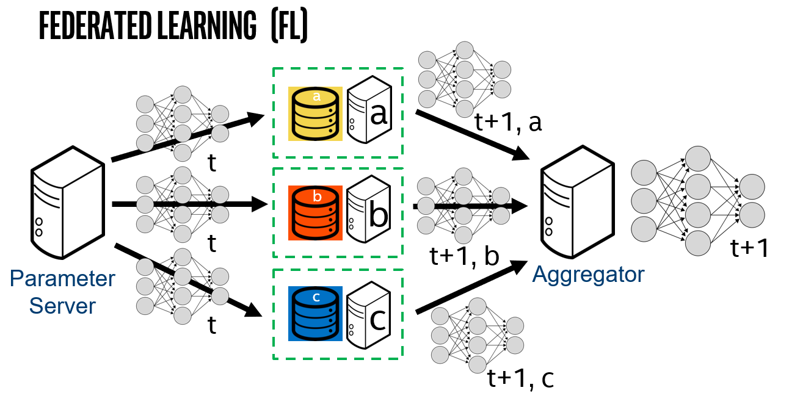

.. # Copyright (C) 2020-2021 Intel Corporation
.. # SPDX-License-Identifier: Apache-2.0

***************************
What is Federated Learning?
***************************

`Federated learning <https://en.wikipedia.org/wiki/Federated_learning>`_ is a distributed machine learning approach that
enables collaboration on machine learning projects without sharing sensitive data, such as patient records, financial data,
or classified secrets (`McMahan, 2016 <https://arxiv.org/abs/1602.05629>`_;
`Sheller, Reina, Edwards, Martin, & Bakas, 2019 <https://www.ncbi.nlm.nih.gov/pmc/articles/PMC6589345/>`_;
`Yang, Liu, Chen, & Tong, 2019 <https://arxiv.org/abs/1902.04885>`_; 
`Sheller et al., 2020 <https://www.nature.com/articles/s41598-020-69250-1>`_).
In federated learning, the model moves to meet the data rather than the data moving to meet the model. The movement of data across the federation are the model parameters and their updates.

.. centered:: Federated Learning

.. _definitions_and_conventions:

***************************
Definitions and Conventions
***************************

Federated learning brings in a few more components to the traditional data science training pipeline:

Collaborator
	A collaborator is a client in the federation that has access to the local training, validation, and test datasets. By design, the collaborator is the only component of the federation with access to the local data. The local dataset should never leave the collaborator.
	
Parameter Server
	A parameter server sends a global model to the collaborators. Parameter servers are often combined with aggregators on the same compute node.

Aggregator
	An aggregator receives locally tuned models from collaborators and combines the locally tuned models into a new global model. Typically, `federated averaging <https://arxiv.org/abs/1602.05629>`_, (a weighted average) is the algorithm used to combine the locally tuned models. 

Round
	A federation round is defined as the interval (typically defined in terms of training steps) where an aggregation is performed. In theory, collaborators may perform local training on the model for multiple epochs (or even partial epochs) within a single training round.

Federated Learning Plan (FL Plan)
	An FL plan defines the address of the aggregator, the workload (model) to send to the collaborators, and other parameters about the federation, such as, the number of federation rounds and the encryption to use for the network connections.
