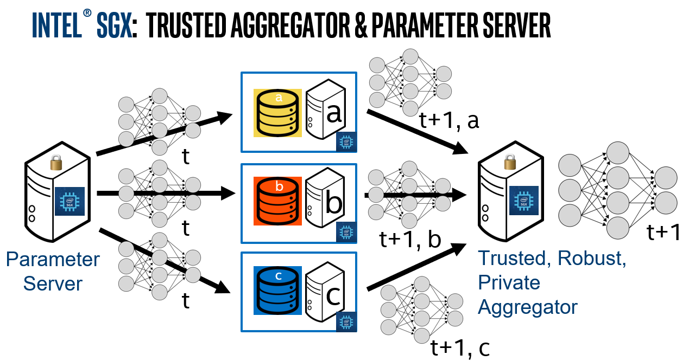
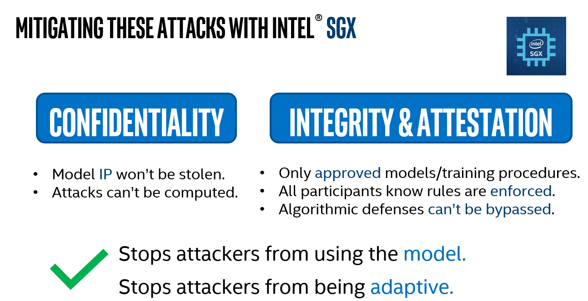

.. # Copyright (C) 2020-2023 Intel Corporation
.. # SPDX-License-Identifier: Apache-2.0

*********************************************
What is Intel\ :sup:`®` \ Federated Learning?
*********************************************

By leveraging the security provided by Intel\ :sup:`®` \ `SGX <https://software.intel.com/content/www/us/en/develop/topics/software-guard-extensions.html>`_ and the ease of deployment
provided by `Graphene <https://github.com/oscarlab/graphene>`_, Federated Learning can be protected from adversarial
attacks that are well documented in the literature. With Intel\ :sup:`®` \ SGX on
every node in the federation, risks are mitigated even if the nodes are
not fully-controlled by the federation owner.

.. centered:: Intel\ :sup:`®` \ Federated Learning

Previous attacks have shown that adversaries may be able to steal the model,
reconstruct data based on the model updates, and/or prevent convergence of
the training when using untrusted nodes
(`Bagdasaryan, Veit, Hua, Estrin, & Shmatikov, 2018 <https://arxiv.org/abs/1807.00459>`_;
`Bhagoji, Chakraborty, Supriyo, & Calo, 2018 <https://arxiv.org/abs/1811.12470>`_).
With Intel\ :sup:`®` \ Federated Learning protected via Intel\ :sup:`®` \ SGX,
adversaries are unable to use the model and unable to adapt their
attacks because the actual training is only visible to those with an
approved key.

Additionally, Intel\ :sup:`®` \ SGX allows developers to require attestation
from collaborators which proves that the collaborator actually
ran the expected code within the enclave. Attestation can either
be done via a trusted Intel server or by the developers own server.
This stops attackers from injecting their own code into the federated training.

.. centered:: Why Intel\ :sup:`®` \ Federated Learning
