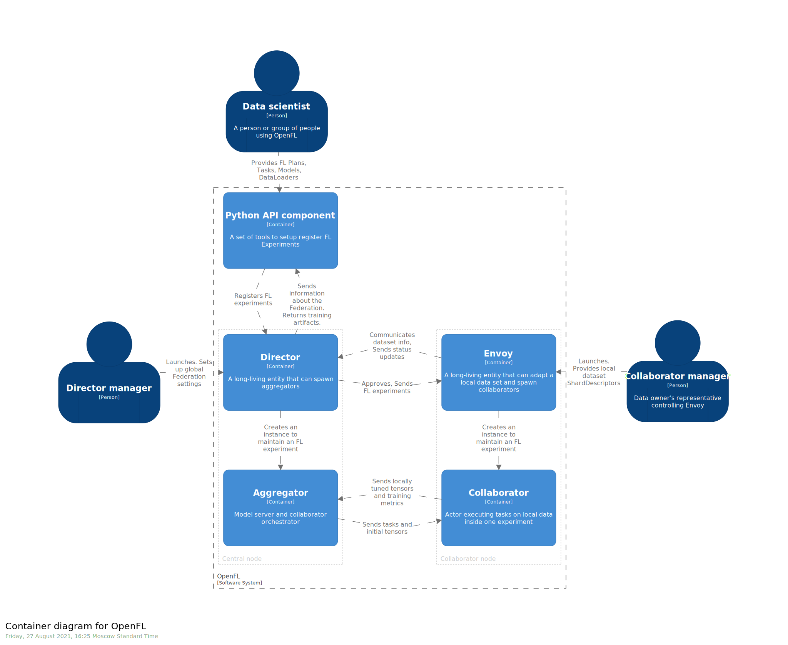

.. # Copyright (C) 2020-2021 Intel Corporation
.. # SPDX-License-Identifier: Apache-2.0

.. _openfl_components:

*****************************
|productName| Core Components
*****************************

.. toctree::
   :maxdepth: 2

   `Short-Lived Components`_
   `Long-Lived Components`_
   `Static Diagram`_

|productName| has the following components:

    - :ref:`openfl_short_lived_components`
    - :ref:`openfl_long_lived_components`

.. _openfl_short_lived_components:

Short-Lived Components
======================

These components are terminated when the experiment is finished.
	
    - The *aggregator* is framework-agnostic, while the *collaborator* can use any deep learning frameworks, such as `TensorFlow* <https://www.tensorflow.org/>`_ or `PyTorch* <https://pytorch.org/>`_.
    - The *collaborator* which uses local dataset to train a global model and the *aggregator* which receives model updates from collaborators and combines them to form the global model.

Aggregator
----------

The *aggregator* is a short-lived entity, which means that its lifespan is limited by the experiment execution time. It orchestrates *collaborators* according to the FL plan and performs model aggregation at the end of each round. 

The *aggregator* is spawned by the :ref:`*Director* <openfl_ll_components_director>` when a new experiment is submitted.

Collaborator
------------

The *collaborator* is a short-lived entity that manages training the model on local data, which includes

    - executing assigned tasks,
    - converting deep learning framework-specific tensor objects to |productName| inner representation, and
    - exchanging model parameters with the *aggregator*.

The *collaborator* is created by the :ref:`*Envoy* <openfl_ll_components_envoy>` when a new experiment is submitted. 

Every *collaborator* is a unique service. The model is loaded with a local *shard descriptor* to perform tasks included in an FL experiment. At the end of the training task, weights are extracted and sent to the central node and aggregated.

Converting tensor objects is handled by :ref:`framework adapter <framework_adapter>` plugins. Included in |productName| are framework adapters for PyTorch and TensorFlow 2.x. These framework adapters are extensible. You can contribute new framework adapters for deep learning frameworks you would like see supported in |productName|. 

.. _openfl_ll_components:

Long-Lived Components
======================

These components continue to be available to distribute more experiments in the federation.
	
    - The *Director* is the central node of the federation. This component starts an *Aggregator* for each experiment, sends data to connected collaborator nodes, and provides updates on the status.
    - The *Envoy* runs on collaborator nodes connected to the *Director*. When the *Director* starts an experiment, the *Envoy* starts the *Collaborator* to train the global model.

.. _openfl_ll_components_director:

Director
--------

The *Director* is a long-lived entity and is the central node of the federation. It runs two services: 

    - frontend Director client
    - interactive Python API

The *Director* supports concurrent frontend connections. While the *Director* may take in several experiments (with the same data interface), the experiments are executed in series.

When an experiment is reported, the *Director* starts an *aggregator* and sends the experiment data to involved *Envoys*. While the experiment is running, the *Director* oversees the *aggregator* and delivers updates on the status of the experiment, which includes trained model snapshots and metrics.

.. note::
    
    Learn more about the :ref:`interactive_api`.
    

.. _openfl_ll_components_envoy:

Envoy
-----

The *Envoy* is a long-lived entity that runs on collaborator nodes connected to the *Director*. 

Every *Envoy* is matched to one `shard descriptor <https://github.com/intel/openfl/blob/develop/openfl/interface/interactive_api/shard_descriptor.py>`_ in order to run. When the *Director* starts an experiment, the *Envoy* accepts the experiment workspace, prepares the environment, and starts a *collaborator*.

Static Diagram
==============

