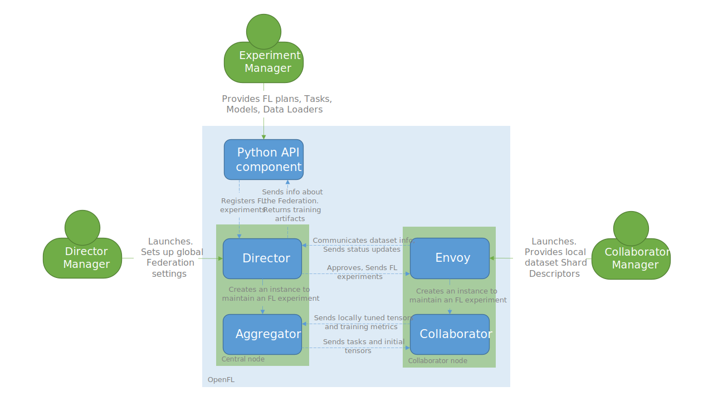

.. # Copyright (C) 2020-2021 Intel Corporation
.. # SPDX-License-Identifier: Apache-2.0

.. _openfl_components:

*****************************
Core Components
*****************************

.. toctree::
   :maxdepth: 2

   `Short-Lived Components`_
   `Long-Lived Components`_
   `Static Diagram`_

Open Federated Learning (|productName|) has the following components:

    - :ref:`openfl_short_lived_components`
    - :ref:`openfl_ll_components`

.. _openfl_short_lived_components:

Short-Lived Components
======================

These components are terminated when the experiment is finished.
	
    - The *Aggregator* which receives model updates from *Collaborators* and combines them to form the global model.
    - The *Collaborator* which uses local dataset to train a global model.

The *Aggregator* is framework-agnostic, as it operates tensors in OpenFL inner representation,
while the *Collaborator* can use deep learning frameworks as computational backend, such as `TensorFlow* <https://www.tensorflow.org/>`_ or `PyTorch* <https://pytorch.org/>`_.

Aggregator
----------

The Aggregator is a short-lived entity, which means that its lifespan is limited by the experiment execution time.
It orchestrates Collaborators according to the FL plan, performs model aggregation at the end of each round,
and acts as a parameter server for collaborators.

Model weight aggregation logic may be customized via :ref:`plugin mechanism <overriding_agg_fn>`.

The Aggregator is spawned by the :ref:`Director <openfl_ll_components_director>` when a new experiment is submitted.

Collaborator
------------

The Collaborator is a short-lived entity that manages training the model on local data, which includes

    - executing assigned tasks,
    - converting deep learning framework-specific tensor objects to |productName| inner representation, and
    - exchanging model parameters with the Aggregator.

The Collaborator is created by the :ref:`Envoy <openfl_ll_components_envoy>` when a new experiment is submitted
in the :ref:`Director-based workflow <director_workflow>`. The Collaborator should be started from CLI if a user follows the
:ref:`Aggregator-based workflow <running_the_federation_aggregator_based>`

Every Collaborator is a unique service. The data loader is loaded with a local *shard descriptor* to perform tasks
included in an FL experiment. At the end of the training task, weight tensors are extracted and sent to the central node
and aggregated.

Converting tensor objects is handled by :ref:`framework adapter <framework_adapter>` plugins.
Included in |productName| are framework adapters for PyTorch and TensorFlow 2.x.
The list of framework adapters is extensible. User can contribute new framework adapters for deep learning frameworks
they would like see supported in |productName|.

.. _openfl_ll_components:

Long-Lived Components
======================

These components were introduced to support the :ref:`Director-based workflow <director_workflow>`.
	
    - The *Director* is the central node of the federation. This component starts an *Aggregator* for each experiment, broadcasts experiment archive to connected collaborator nodes, and provides updates on the status.
    - The *Envoy* runs on collaborator nodes and is always connected to the *Director*. When the *Director* starts an experiment, the *Envoy* starts the *Collaborator* to train the global model.

These components stay available to distribute several of experiments in the federation.

.. _openfl_ll_components_director:

Director
--------

The Director is a long-lived entity and is the central node of the federation. It accepts connections from:

    - Frontend clients (data scientists using :ref:`interactive_python_api`)
    - Envoys, if their Shard Descriptors are complient to the same data interface

The Director supports concurrent frontend connections.
While the Director may take in several experiments, the experiments are executed in series.

When an experiment is reported, the Director starts an Aggregator and sends the experiment data to involved Envoys.
While an experiment is running, the Director oversees the Aggregator and delivers updates on the status of
the experiment, which includes trained model snapshots and metrics by request.

.. _openfl_ll_components_envoy:

Envoy
-----

The Envoy is a long-lived entity that runs on collaborator nodes connected to the Director. 

Every Envoy is matched to one `shard descriptor <https://github.com/intel/openfl/blob/develop/openfl/interface/interactive_api/shard_descriptor.py>`_
in order to run. When the Director starts an experiment, the Envoy accepts the experiment workspace,
prepares the environment, and starts a Collaborator.

The envoy is also responsible for sending heartbeat messages to the Director. These messages may also include information
regarding collaborator machine resource utilization. Refer to :ref:`device monitor plugin <device_monitor_plugin>` for details.

Static Diagram
==============

